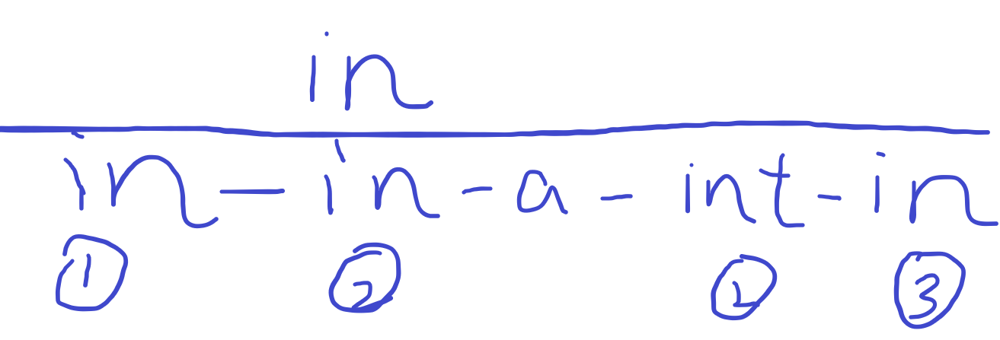

## [EOJ] 实训题 P3018 查找单词

先把题目地址贴出来：[P3018 查找单词](https://acm.ecnu.edu.cn/problem/3018/)


### 题干

有一个单词 `W`，输出它在字符串 `S` 中从左到右第一次出现的位置 `IDX`(设 `S` 中的第 1 个字符的位置为 1)。`W` 只由英文字母组成，`S` 除英文字母和汉字之外在任何位置（包括头和尾）另有一个或多个连续的空格。

查找单词时，不区分大小写，但要求完全匹配，即单词 `W` 必须与 `S` 中的某一独立单词在不区分大小写的情况下完全匹配。`W` 仅是 `S` 中某一单词的一部分就不算匹配。

### 输入格式

第 1 行：一个整数 *T* (1≤*T*≤10) 为问题数。

接下来共 2*T* 行，对应每个问题有 2 行，表示 *W* 和 *S* (1≤*W*长度≤10;1≤*S*长度≤1000000)。

### 输出格式

对于每个问题，输出一行问题的编号（0 开始编号，格式：`case #0:` 等）。

然后对应每个问题在一行中输出 *I**D**X*。
		 `S` 中没有找到 `W` 时输出 `None`。

### 样例

Input

```
3
IN
Find a word within a string in English and in Chinese.
to
    Find a word within a string in English and in Chinese.
In
    Find a word within a string in English and in Chinese.
```

Output

```
case #0:
29
case #1:
None
case #2:
33
```


### 核心代码

#### 思路：

此题思路上很简单。但实现起来有坑。写出来与大家一起避避雷。

`tolower()替换大小写一致 + find函数搜索 + 遍历判断 `

1. 多case输入，先整理好case格式，注意由于我们要用 `getline`来接受整行字符串，所以这里必须在每一组输入T后，用`get()`清除多余的换行符。

2. 对于每组输入，第一行为一个单词，第二行为一个任意的字符串，其中可能包含数量不等随机出现的空格。显然，应该定义两个字符串分别接收这两行。我选择都用 `getline`，单词用 `cin`直接输入也可。

3. 正式进入搜索过程。其实显然想到用c++ string类自带的 `find`函数。这个函数会返回第一次出现某个字符串的下标。但题目要求，搜索到的字符串不能是被包含在一个更长的字符串中的。如：单词w为in，而第二行的待搜索串为int，这样显然find是会返回下标0的。与我们想要的情况不符合。所以要加上额外的判断情况。

4. 写了一种情况如下图：帮助理解。

   

   

   - 第一行的in为单词，第二行的in in a int in则是待搜索串。中间的‘-’代表一个或多个空格。
   - 分别考虑1.2.3三种情况，分别对应开头、中间、尾部三种情况。对于2我画了两种分别是匹配成功和匹配失败的情况。对于1.3严格来说也有两种，不过情况类似就不赘述了。
   - 先观察2：显然，如果匹配成功，一定会使得目标单词左侧和右侧均为空格。即： `ans[pos + len] == ' ' && ans[pos - 1] == ' '`。其中pos代表find函数返回的下标，len是单词的长度。ans代表待搜索的字符串。画个图很容易看出这是成立的。
   - 再观察1和3：以1为例，如果仍然用在中间匹配的规则去判断，很容易发现pos - 1访问到了下标为-1的位置，这显然是错误也是不安全的，以EOJ的习惯就是直接报RTE（runtime error）。所以这里需要加一条来判断开头： `pos == 0`。同样对于3的尾部也要加一条 `pos + len == ans.size()` 整合一下，综合的判断条件为：`if(( pos + len == ans.size()  ||  ans[pos + len] == ' ' ) && ( pos == 0  || ans[pos - 1] == ' ' ))`。
   - 此外还有一个要解决的问题是，匹配到一个字符串，如果是被包含的匹配，那么势必要继续向后查找，所以我们外圈要套一个循环，利用`find（）`函数的可以指定开始查找位置，每次更新起始查找位置。直到匹配成功就返回下标，或者匹配失败&字符串遍历结束。
   - 思路捋清楚以后就是具体的实现问题。下面就是我要说的坑了！！

5. 首先给出源码：

#### 完整AC代码如下：

```cpp
#include <iostream>
#include <string>
#include <cstdio>
using namespace std;
void solve()/* Define function solve() to process one case of the problem    */
{
    string ss = "", ans = "";
    getline(cin, ss);
    getline(cin, ans);
    for(auto &i : ss) // 先分别转小写
        i = tolower(i);
    for(auto &i : ans)
        i = tolower(i);
    for(int i = 0; ;) // 对被查找的字符串进行遍历，每次从位置i开始找
    {
        unsigned int pos = 0;
        int len = ss.size();
        if(ans.find(ss, i) == string::npos || i == ans.size()){
            cout << "None" << endl;
            break;
        }
        else{
            pos = ans.find(ss, i);
            if(( pos + len == ans.size()  ||  ans[pos + len] == ' ' )
                    && ( pos == 0  || ans[pos - 1] == ' ' )){
                cout << pos + 1 << endl; // 输出位置即可 题目要求从1开始输
                break;
            }
            i = pos + len; // 重新定位查找位置
        }
    }
    return ;
}
/******************************************************************************/
/*  DON'T MODIFY main() function anyway!                                      */
/******************************************************************************/
int main()
{
    int T, i;
    (cin >> T).get();
    for(i = 0; i < T; ++i)
    {
        cout << "case #" << i << ":\n";
        solve();
    }
    return 0;
}


```

6. 坑就在于 `if(( pos + len == ans.size()  ||  ans[pos + len] == ' ' )
                       && ( pos == 0  || ans[pos - 1] == ' ' ))` 

   这个地方千万不能把 || 连接的表达式换位，即写成 ：

   ```cpp
   if((ans[pos + len] == ' ' || pos + len == ans.size()) 
                  && (ans[pos - 1] == ' ' || pos == 0)) 
   ```

   这里看似和上面的表达并无二样，其实是非常有风险的。由于||的特性，它先判断前面的表达式，那么很容易导致访问到内存非法区域。而如果采用第一种表达方式，当pos + len或pos-1是非法位置时，它们已经先被判断出了非法，也不就不会实际被访问了。

   这是我编程时候的不好的习惯，随手写出来，在EOJ中只会报一个RTE，也很难看出来问题。最终试了很久发现了问题。引以为戒！
